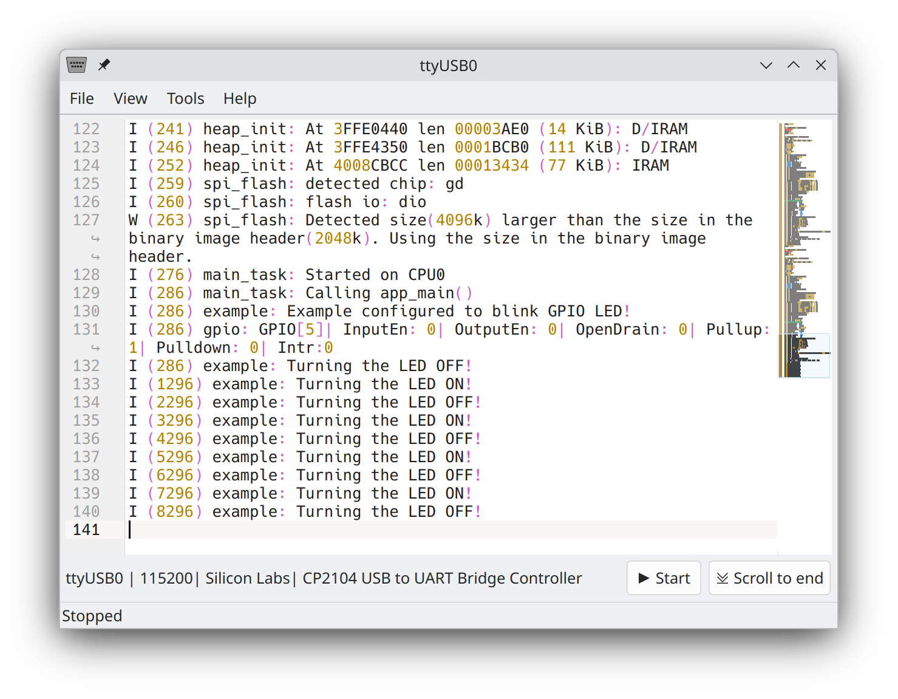

# yeTTY

yeTTY is an open source application for embedded developers to view logs from serial port.

## Building

**1. Install dependencies**

Debian bookworm:
```
sudo apt install cmake g++ qtbase5-dev libqt5serialport5-dev qtmultimedia5-dev libkf5texteditor-dev libzstd-dev libsystemd-dev
```
Debian trixie:
```
sudo apt install cmake g++ qt6-base-dev qt6-serialport-dev qt6-multimedia-dev libkf6texteditor-dev libzstd-dev libsystemd-dev
```
**2. Build**

```
cmake -B build .
cmake --build build

```

**3. Install**
```
cmake --install build
```
